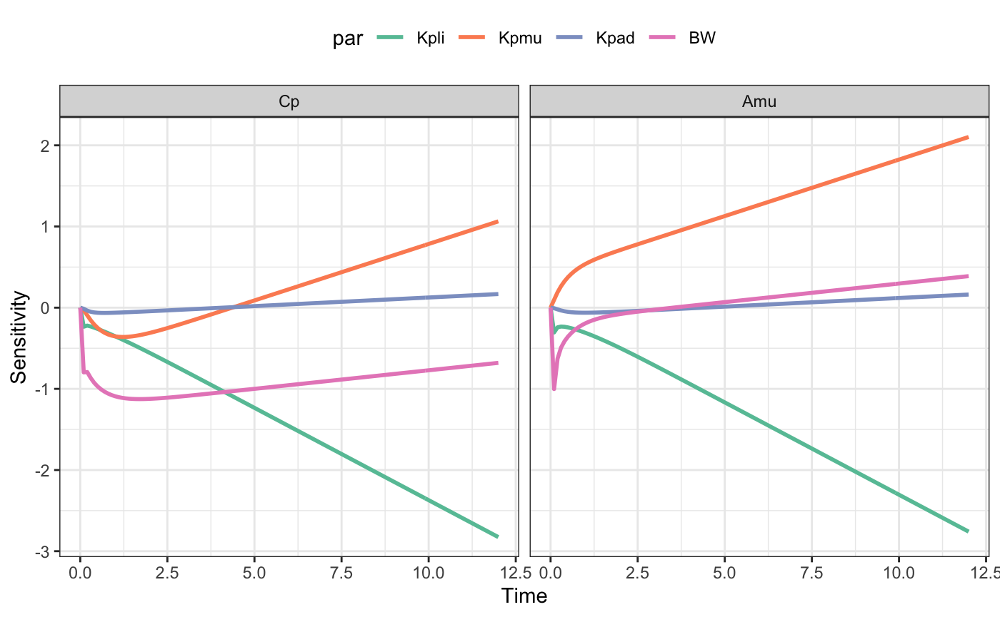

local sensitivity analysis with mrgsolve
================

# Model

Load the vera package and a model from the mrgsolve package. We increase
the tolerance a bit as well as the maximum step size.

``` r
library(vera)

mod <- modlib(
  "pbpk", 
  end = 12, delta = 0.1, 
  atol = 1E-20, rtol = 1E-12, hmax=0.5
)
```

# Scenario

Create a function that uses the model to simulate a certain scenario.
For now, we just simulate a single dose.

``` r
fun <- function(p,dose) {
  mod %>% 
    param(p) %>% 
    ev(dose) %>% 
    mrgsim_df()
}

d <- ev(amt = 100)
```

# Sensitivity analysis

Use `vera::lsa()`. We pick the paramters that we want to fiddle with
(`par`) and the output that we want to look at (`Cp` and `Amu` - the
amount in the muscle compartment). `d` gets passed through to the
function as `dose`.

``` r
out <- lsa(mod, fun, par = "Kpli,Kpmu,BW,Ka", var = "Cp,Amu", dose = d)
```

# Ouput

The output is long and ready to send in to `ggplot2`.

``` r
head(out)
```

    .   time var    value  par       sens
    . 1  0.0  Cp 0.000000 Kpli  0.0000000
    . 2  0.0  Cp 0.000000 Kpli  0.0000000
    . 3  0.1  Cp 0.913300 Kpli -0.2344372
    . 4  0.2  Cp 1.240780 Kpli -0.2207772
    . 5  0.3  Cp 1.425315 Kpli -0.2315567
    . 6  0.4  Cp 1.546065 Kpli -0.2460310

There is a default plotting method as well.

``` r
plot(out)
```

<!-- -->
